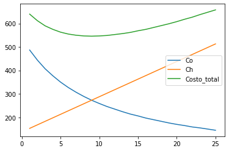

```python
# Programa numero 1 de modelado de inventario
# Nombres: Brangy Gabriel Castro Vara
# Nivel: 10mo "B"

#Importamos las liberias
from pandas import DataFrame
import numpy as np
from math import sqrt
import matplotlib.pyplot as plt

# Declaramos las variables con su valor inicial
# D = Demanda
D = 12000.00
# Co = Costo de ordenar
Co = 25.00
# Ch = Costo de Mantenimiento
Ch = 0.50
# P = Costo del Producto: precio por unidad de articulo
P = 2.50
DiasAno = 250

# Realizamos el proceso de EOQ
# Q = Cantidad optima de pedido
Q = round(sqrt(((2*Co*D)/Ch)), 2)
# N= númeor de pedidos
N = round(D / Q, 2)
# T= tiempo entre pedido
T = round(DiasAno / N, 2)
# CoT = Costo anual de ordenar
CoT = N * Co
# ChT= Costo anual de mantener
ChT = round(Q / 2 * Ch, 2)
# MO(Q)=Costo total de orden y mantener inventario
MOQ = round(CoT + ChT, 2)
# MTT = Costo total de Inventario
CTT = round(P * D + MOQ, 2)

# Co = Costo de ordenar
# Ch = Costo de Mantenimiento
# Generamos una lista ordenada de valores de Q
indice = ['Q', 'Co', 'Ch',
          'Costo_total', 'Diferencia_Costo_Total']

periodo = np.arange(1, 26)


# Generamos los valor de Q= Cantidad optima de pedido
def genera_cantidad(Q):
    n = 25
    Q_Lista = []
    i = 1
    Qi = Q
    Q_Lista.append(Qi)
    for i in range(1, 9):
        Qi = Qi - 60
        Q_Lista.append(Qi)

    Qi = Q
    for i in range(9, n):
        Qi = Qi + 60
        Q_Lista.append(Qi)

    return Q_Lista

# Almacenamor los resultados de la función de GENERAR_CANTIDAD
Lista = genera_cantidad(Q)
# Se ordena la lista
Lista.sort()

dfQ = DataFrame(index=periodo, columns=indice).fillna(0)

# Asignamos en la posicion Q la lista generada anteriormente
dfQ['Q'] = Lista

# recoremos y asigamos los valores que hacen faltan como CO, CH, COSTO TOTAL, 
for period in periodo:
    dfQ['Co'][period] = D * Co / dfQ['Q'][period]
    dfQ['Ch'][period] = dfQ['Q'][period] * Ch / 2
    dfQ['Costo_total'][period] = dfQ['Co'][period] + \
        dfQ['Ch'][period]
    dfQ['Diferencia_Costo_Total'][period] = dfQ['Costo_total'][period] - MOQ

# Se mostraran los datos completos 
dfQ
# Filtramos los datos para que solo aparecan CO, CH, COSTO TOTAL
dfG = dfQ.loc[:, 'Co':'Costo_total']
dfG
# Muetra la grafica con los valores filtrados
dfG.plot()
```

    <ipython-input-24-9dd386ca8f1c>:77: SettingWithCopyWarning: 
    A value is trying to be set on a copy of a slice from a DataFrame
    
    See the caveats in the documentation: https://pandas.pydata.org/pandas-docs/stable/user_guide/indexing.html#returning-a-view-versus-a-copy
      dfQ['Co'][period] = D * Co / dfQ['Q'][period]
    <ipython-input-24-9dd386ca8f1c>:78: SettingWithCopyWarning: 
    A value is trying to be set on a copy of a slice from a DataFrame
    
    See the caveats in the documentation: https://pandas.pydata.org/pandas-docs/stable/user_guide/indexing.html#returning-a-view-versus-a-copy
      dfQ['Ch'][period] = dfQ['Q'][period] * Ch / 2
    <ipython-input-24-9dd386ca8f1c>:79: SettingWithCopyWarning: 
    A value is trying to be set on a copy of a slice from a DataFrame
    
    See the caveats in the documentation: https://pandas.pydata.org/pandas-docs/stable/user_guide/indexing.html#returning-a-view-versus-a-copy
      dfQ['Costo_total'][period] = dfQ['Co'][period] + \
    <ipython-input-24-9dd386ca8f1c>:81: SettingWithCopyWarning: 
    A value is trying to be set on a copy of a slice from a DataFrame
    
    See the caveats in the documentation: https://pandas.pydata.org/pandas-docs/stable/user_guide/indexing.html#returning-a-view-versus-a-copy
      dfQ['Diferencia_Costo_Total'][period] = dfQ['Costo_total'][period] - MOQ


    <matplotlib.axes._subplots.AxesSubplot at 0x7faf62afc5b0>





